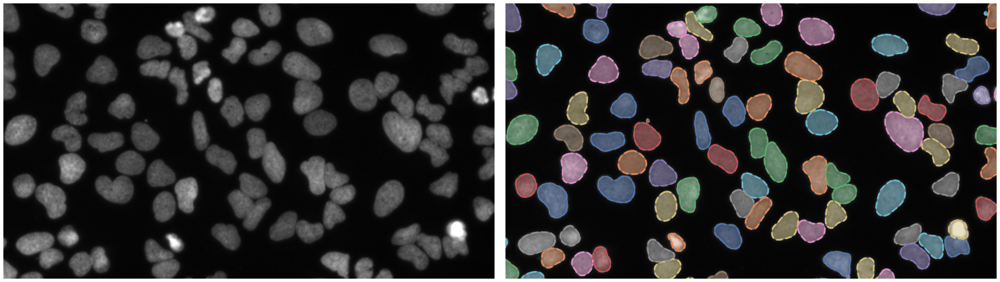
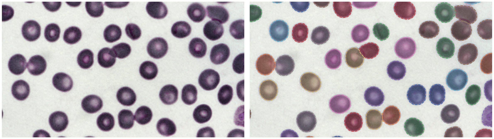

Cell Detection
==============

A Python package for Cell Detection with PyTorch.

Showcase
--------

Nuclei of U2OS cells in a chemical screen
^^^^^^^^^^^^^^^^^^^^^^^^^^^^^^^^^^^^^^^^^

https://bbbc.broadinstitute.org/BBBC039 (CC0)

P. vivax (malaria) infected human blood
^^^^^^^^^^^^^^^^^^^^^^^^^^^^^^^^^^^^^^^

https://bbbc.broadinstitute.org/BBBC041 (CC BY-NC-SA 3.0)

Content
-------

.. toctree::
   :maxdepth: 1

   intro
   started
   examples

API Reference
-------------

.. toctree::
   :maxdepth: 1

   celldetection
   celldetection.data
   celldetection.models
   celldetection.mpi
   celldetection.ops
   celldetection.optim
   celldetection.callbacks
